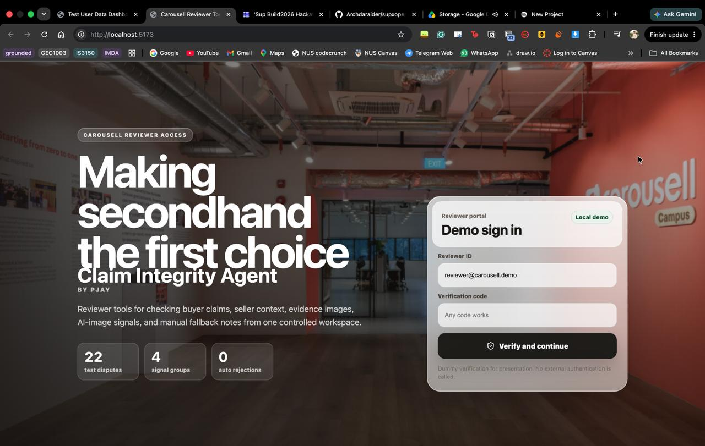
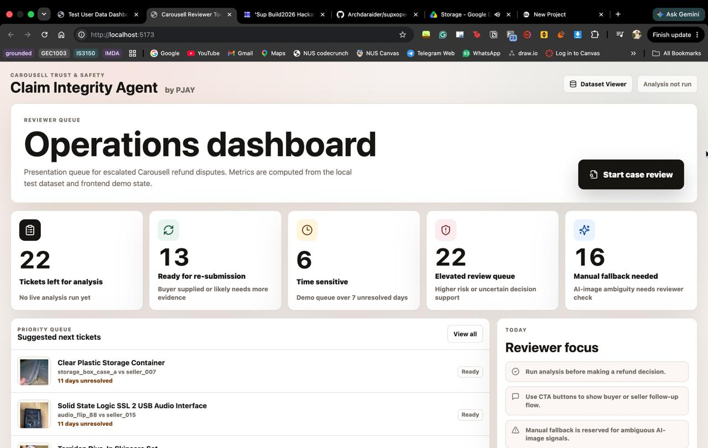

# Claim Integrity Agent

Claim Integrity Agent is a Carousell trust-and-safety reviewer prototype for refund disputes. It turns local dispute data into a structured review workflow, then combines behavioural context, evidence sufficiency, OpenAI vision reasoning, and Sightengine image-likelihood checks into a single reviewer-facing recommendation.

The project was built as a hackathon demo, but the implementation is intentionally realistic: the backend assembles cases from local JSON datasets, the frontend presents a reviewer queue and case workspace, and the scoring engine applies guardrails so no single weak signal can force a fraud conclusion.

## Executive Summary

This project models how a marketplace reviewer could evaluate a disputed secondhand purchase after the buyer claims damage, the seller rejects the refund, and the case is escalated to Carousell. The objective is not automated punishment. It is decision support: show the reviewer the relevant case history, surface the strongest signals, and preserve uncertainty when the evidence is incomplete.

The demo includes two main experiences:

- A branded login and landing screen that frames the product as a reviewer portal.
- An operations dashboard that prioritizes escalated disputes and opens a deeper case-review workspace with risk scoring, evidence panels, timeline context, and manual fallback notes.





## What The System Does

The workflow follows a simple reviewer journey:

1. A buyer purchases an item from a seller.
2. The buyer submits a refund claim with evidence images and a damage description.
3. The seller rejects the request.
4. The dispute is escalated to Carousell.
5. The reviewer opens the case in the reviewer UI.
6. The reviewer clicks `Run analysis`.
7. The system returns a risk level, a recommended action, signal breakdowns, evidence used, and guardrails or limitations.

The tool is explicitly designed as reviewer assistance, not auto-resolution. It does not claim fraud, and it does not auto-reject cases.

## Product Architecture

The repository is split into three main layers:

- `reviewer-ui/` - React + Vite frontend for the login screen, operations dashboard, case queue, case file, and analysis panel.
- `reviewer-api/` - Express + TypeScript API that serves cases, images, and analysis results.
- `data/` - Structured fixture data and claim/reference images that simulate real dispute records.

There is also a generated dataset dashboard in `dataset-dashboard.html`, built from the local data for a broad presentation view of the case library.

### Frontend

The reviewer UI is a single-page app that renders two distinct product surfaces:

- The login / landing screen shown in `landing.jpg`.
- The operations dashboard shown in `dashboard.jpg`, which contains queue metrics, priority cases, reviewer guidance, and the review workspace.

The UI fetches cases from the API, lets the reviewer open a case, and then triggers analysis against the selected dispute. It also links out to the dataset dashboard for a broader view of the underlying fixture data.

### Backend

The API is responsible for:

- Loading and joining the local dataset files into complete review cases.
- Serving case lists and case details.
- Serving claim and reference images.
- Running the multi-signal scoring pipeline.
- Caching analysis results per case.

The main endpoints are:

- `GET /api/health`
- `GET /api/cases`
- `GET /api/cases/:id`
- `POST /api/cases/:id/analyze`
- `GET /api/images/claims/:filename`
- `GET /api/images/reference/:filename`

### Data Model

The local dataset is built from:

- `data/accounts.json`
- `data/sellers.json`
- `data/orders.json`
- `data/products.json`
- `data/claims.json`
- `data/images/claims/`
- `data/images/reference/`

Each case combines buyer, seller, order, product, claim, and image records into a single reviewer-ready object. The dataset is intentionally shaped around dispute analysis rather than generic ecommerce browsing.

### Scoring Pipeline

The analysis engine combines four signals:

- Behavioural context `40%`
- Sightengine AI image likelihood `35%`
- Physical plausibility `15%`
- Evidence sufficiency `10%`

The score is then adjusted by guardrails:

- Physical plausibility alone cannot produce `High`.
- Behavioural context alone cannot produce `High`.
- Low detector confidence is not treated as proof of authenticity.
- Missing API-backed signals are marked `not_configured` and excluded from weighted scoring.
- Same-order claim clusters are capped so logistics or fulfilment issues do not get misclassified as buyer fraud.

The final output includes:

- `finalRiskScore`
- `finalRiskLevel`
- `recommendedAction`
- `summary`
- individual signal results
- guardrails applied

## Demo Screens

### Landing Screen

The landing screen is the reviewer-facing entry point. It positions the system as a controlled trust-and-safety workspace and frames the core promise:

- reviewers inspect buyer claims
- the system checks context, evidence, and image signals
- manual fallback remains available for ambiguous cases

### Operations Dashboard

The dashboard shows:

- queue metrics for unresolved tickets
- a priority list of suggested next cases
- reviewer focus notes
- the selected case file and evidence panel
- the analysis action that runs the scoring pipeline

The visual design intentionally reads like an internal operations tool rather than a consumer app.

## Running Locally

### Prerequisites

- Node.js 18 or newer
- npm
- Python 3 if you want to serve the generated dataset dashboard

### Install

```bash
cd reviewer-api
npm install

cd ../reviewer-ui
npm install
```

### Start The API

```bash
cd reviewer-api
npm run dev
```

### Start The UI

```bash
cd reviewer-ui
npm run dev
```

### Optional Dataset Dashboard

```bash
python3 -m http.server 8080
```

Then open:

- Reviewer UI: `http://localhost:5173`
- Reviewer API health: `http://localhost:3001/api/health`
- Dataset dashboard: `http://localhost:8080/dataset-dashboard.html`

## Environment Variables

The project runs in a fully local demo mode by default. Optional API-backed signals only activate when keys are configured.

### Backend

```bash
PORT=3001
DATA_ROOT=..
OPENAI_API_KEY=
OPENAI_MODEL=gpt-5.5
SIGHTENGINE_API_USER=
SIGHTENGINE_API_SECRET=
REVIEWER_ANALYZE_TOKEN=
DATASET_DASHBOARD_URL=http://localhost:8080/dataset-dashboard.html
```

### Frontend

```bash
VITE_API_URL=http://localhost:3001
VITE_REVIEWER_ANALYZE_TOKEN=
VITE_DATASET_DASHBOARD_URL=http://localhost:8080/dataset-dashboard.html
```

If OpenAI or Sightengine keys are enabled, the backend expects a local reviewer token for analysis requests. That keeps the demo flow explicit and avoids accidental use of paid APIs without an agreed local token.

## Dataset And Evaluation Notes

The local dataset is built to exercise different reviewer outcomes, not just obvious fraud:

- clean or plausible claims
- ambiguous image evidence
- repeated claims on the same order
- seller-side packaging complaints
- high-value electronics disputes
- cases where physical plausibility and detector output disagree

The dataset manifest and schema docs explain the private evaluation labels and the intended outcome bands used during development:

- `data/CANONICAL_DATASET.md`
- `data/CUSTOM_DATASET_SCHEMA.md`
- `data/IMAGES_MANIFEST.md`

## Signal Details

### Behavioural Context

This signal looks at account age, refund history, claim velocity, seller context, product value, and order-level claim clustering. It is designed to provide context, not proof.

### Evidence Sufficiency

This signal checks whether the case has enough material to make a judgment responsibly. Missing or weak images, thin seller responses, and incomplete dispute context push the reviewer toward follow-up instead of certainty.

### OpenAI Physical Plausibility

When `OPENAI_API_KEY` is configured, the backend sends the claim image, buyer claim, seller response, product material, and typical failure modes to OpenAI for visual reasoning. The model returns structured JSON with a plausibility assessment, visible damage notes, confidence, and limitations.

### Sightengine AI Image Likelihood

When `SIGHTENGINE_API_USER` and `SIGHTENGINE_API_SECRET` are configured, the backend sends the claim image to Sightengine using the `genai` model. The result is framed as AI image likelihood, not provenance verification.

## Project Structure

```txt
.
|-- data/
|-- docs/
|-- reviewer-api/
|-- reviewer-ui/
|-- tools/
|-- dataset-dashboard.html
|-- landing.jpg
`-- dashboard.jpg
```

## Design Intent

The product intentionally looks like a real internal operations tool:

- calm, professional UI instead of generic SaaS styling
- strong hierarchy for reviewer decision-making
- direct language about evidence and uncertainty
- clear separation between data context, analysis, and action

This matters because the main point of the hackathon submission is not just that the app runs. It is that the workflow feels believable for an integrity reviewer and communicates trustworthy decision support.

## Notes

- API-backed signals are optional and safely degrade when keys are missing.
- Manual fallback is available for ambiguous cases in the UI.
- The repository includes both the application code and the fixture data used to demonstrate the workflow end to end.
